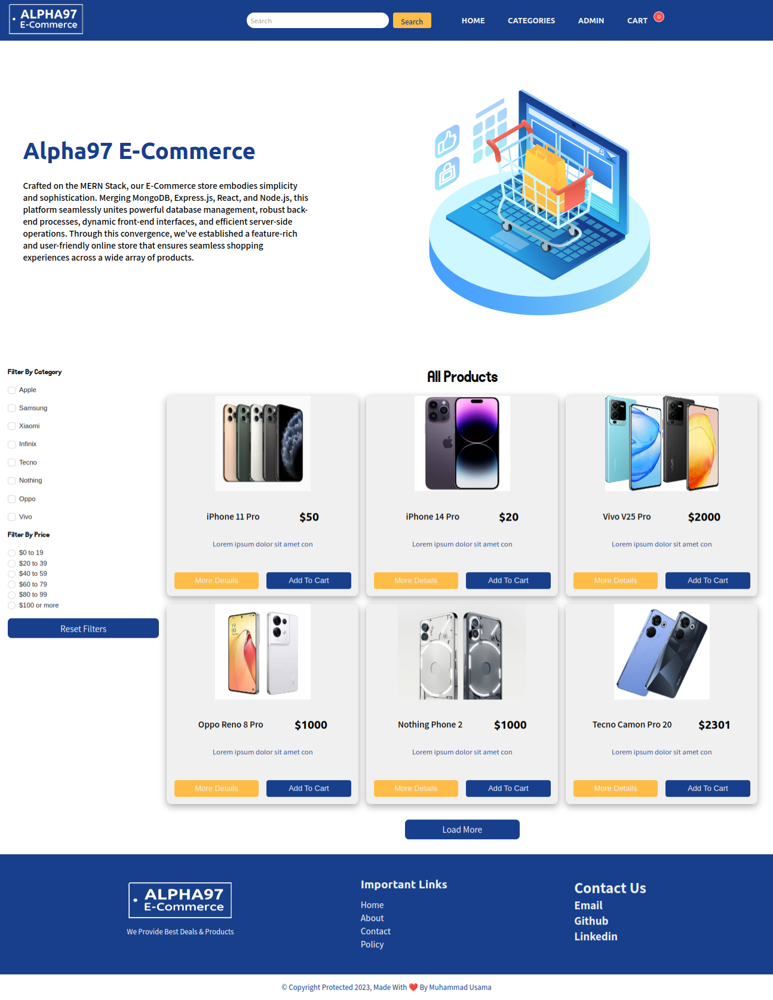

# Minimal E-Commerce Store (MERN Stack)



Welcome to our Minimal E-Commerce Store built using the MERN (MongoDB, Express, React, Node.js) stack. This application provides a user-friendly and efficient platform for browsing, searching, and purchasing products. It includes features such as user authentication, product categorization, shopping cart management, secure payment processing, and more.

## Features

- User Registration and Authentication
- Browse Products by Categories
- Product Details and Descriptions
- Add and Manage Products in the Shopping Cart
- Secure Payment Processing through Braintree
- User Profile Management
- Admin Dashboard for Product and Category Management

## Deployment

The application has been successfully deployed and can be accessed at [Live Demo](https://drab-gold-narwhal-gown.cyclic.cloud/).

## Technologies Used

- Frontend: React, Vite
- Backend: Node.js, Express.js
- Database: MongoDB
- Payment Integration: Braintree
- Styling: SCSS
- State Management: Context API
- Routing: React Router
- Authentication: JWT (JSON Web Tokens)
- Deployment: Cyclic

## Main Repo

```
git clone https://github.com/alphadev97/ecommerce-mern-project
```

## Deployed Repo

```
git clone https://github.com/alphadev97/production-ecommerce-mern.git
```

## .env Variables

```
PORT =
DEV_MODE =
MONGO_URL =
JWT_SECRET =
BRAINTREE_MERCHANT_ID =
BRAINTREE_PUBLIC_KEY =
BRAINTREE_PRIVATE_KEY =
```

## Contributing

Contributions are welcome! Please create a pull request or open an issue if you encounter any bugs or have suggestions for improvements.

## License

This project is licensed under the [MIT License](./LICENSE).
